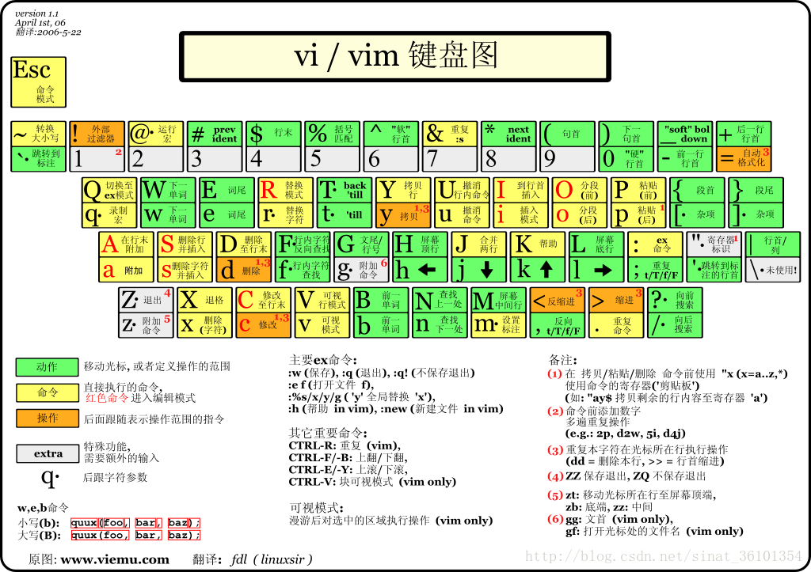

# about question

## 为什么要使用vim而不是vscode

虚拟机有点带不动vscode，会有一些延迟之类的

## vim 配置项
```
1.按F5可以直接编译并执行C、C++、java代码以及执行shell脚本，按“F8”可进行C、C++代码的调试

2.自动插入文件头 ，新建C、C++源文件时自动插入表头：包括文件名、作者、联系方式、建立时间等，读者可根据需求自行更改

3.映射“Ctrl + A”为全选并复制快捷键，方便复制代码

4.按“F2”可以直接消除代码中的空行

5.“F3”可列出当前目录文件，打开树状文件目录

6. 支持鼠标选择、方向键移动
osh 
7. 代码高亮，自动缩进，显示行号，显示状态行

8.按“Ctrl + P”可自动补全

9.[]、{}、()、""、' '等都自动补全

10.其他功能读者可以研究以下文件
```




## vim卡住死机

1、问题：

vim 卡住 死机

2、原因：

使用vim时，会因为不小心按了Ctrl + s后，会发现不能输入任何字符，类似死机；

这并不是Linux死机，或者vim卡住，而只是按了Ctrl + s后，vim停止向终端输出。

3、解决方法：

退出这种状态，按下Ctrl + q 。

